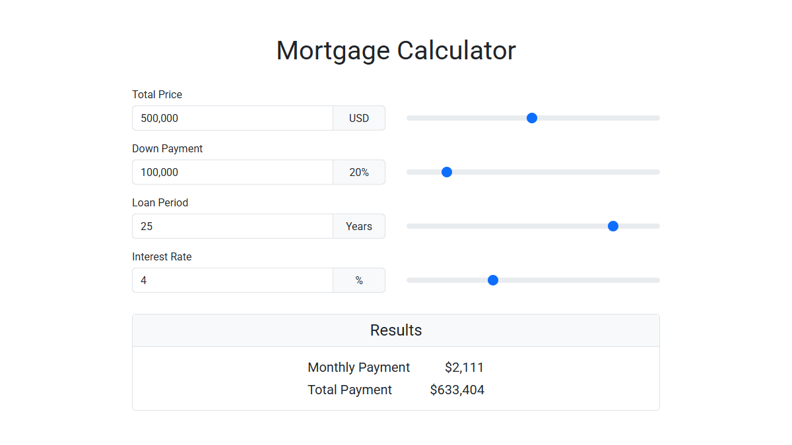

# Mortgage Calculator
The Mortgage Calculator is a JavaScript plugin that allows visitors
to calculate their monthly and total mortgage payments easily.
Its key feature is that each input field is paired with a corresponding slider,
making data entry fast and intuitive.

**Live Demo:**
[https://work.arsen.pro/mortgage-calculator/](https://work.arsen.pro/mortgage-calculator/)

## Features
* Slider controls for inputs
* Keyboard accessible
* Responsive layout
* Semantic markup
* Lightweight
* Easy to customize

## Technologies
* JavaScript (ES6+)
* HTML5
* CSS3
* Bootstrap 5

## How to use
1. Add the calculator form to your page: `
…
`.
2. Include `mortgage-calculator.css` and `mortgage-calculator.js`.
3. Initialize the calculator with your options.

## Options
| Option          | Default | Description                      |
|-----------------|---------|----------------------------------|
| price           | 1000000 | Initial property price (USD)     |
| downPayment     | 20      | Initial down payment (%)         |
| loanPeriod      | 25      | Initial loan period (years)      |
| interestRate    | 4       | Initial interest rate (%)        |
| minPrice        | 10000   | Minimum allowed price (USD)      |
| maxPrice        | 2000000 | Maximum allowed price (USD)      |
| minDownPayment  | 10      | Minimum allowed down payment (%) |
| maxDownPayment  | 80      | Maximum allowed down payment (%) |
| minLoanPeriod   | 1       | Minimum loan period (years)      |
| maxLoanPeriod   | 30      | Maximum loan period (years)      |
| minInterestRate | 1       | Minimum interest rate (%)        |
| maxInterestRate | 10      | Maximum interest rate (%)        |